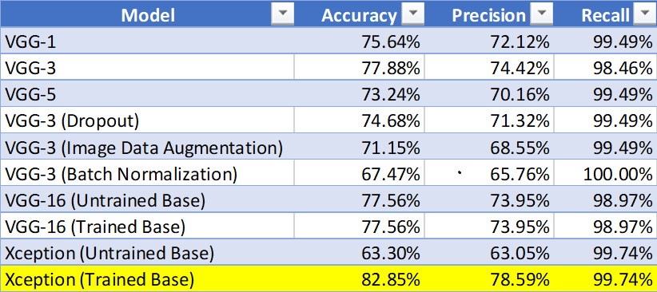

# Network Intrusion Detection System

## Table of Contents
* [General Info](#General-Info)
* [Technologies](#Technologies)
* [Final Models' Results](#Final-Models'-Results)
* [Recommendations](#Recommendations)
* [Further Studies](#Further-Studies)

## General Info
This project was undertaken in May of 2020 during the Covid-19 pandemic in the United States. At the time the United States had seen well over a million confirmed cases and nearly one hundred thousands deaths. Despited having tested over ten million people, many parts of the United States, particularly rural areas, had been facing difficulty testing suspected patients. At the time of writing (5/17/2020) our hospital in Wenatchee, WA has not been able to test anyone suspected of Covid-19 for the past week due to an unavailability of tests.

In order to properly re-open the economy swiftly and save ourselve from longterm financial turmoil it is necessary be able to diagnose Covid-19 patients with on demand and extremely quick turnaround times. Using existing x-ray technology along with machine learning has the potential to facilitate rapid diagnoses when and where testing is unavailable.

This is the problem which inspired this project. Due to limited x-ray images of Covid-19 patients available, the idea was to train a model on more general pneumonia cases (plentiful data) and apply that model to diagnosing Covid-19.

## Technologies
This project was created using the following languages and libraries. An environment with the correct versions of the following libraries will allow re-production and improvement on this project. 

* Python version: 3.6.9
* Matplotlib version: 3.0.3
* Seaborn version: 0.9.0
* Sklearn version: 0.20.3
* TensorFlow version: 1.14.0
* Keras version: 2.3.0

## Final Models' Results

### Pneumonia Detection
Our best model, the Xception model with trained base layers, had just over 82% accuracy and was capable of detecting over 99.7% of pneumonia cases. Unfortunately, our model also appears to be highly sensitive and led to a relatively high false positive rate. However, in the medical field it is much more preferable to have a high false positive rate than a high false negative rate. Furthermore, such challenges are typical in the medical industry with unbalanced datasets.  

### Covid-19 Detection
Unfortunately, our model was not able to generalize well to Covid-19 patients. Though our final model detected 85% of Covid-19 cases the accuracy was at 60% - hardly better than an educated guess. Perhaps some of these patients had not yet developed a severe enough case of pneumonia to be detectable by x-ray. Or perhaps our model had been trained on too many cases of bacterial pneumonia which appear different than viral pneumonia in x-ray images. 

## Recommendations

Though our model has proven well at detecting typical pneumonia cases, I would not recommend it in detecting Covid-19 cases. It is possible that by the time Covid-19 has progressed to the point of being detectable by x-ray the patient is already in critical condition and likely hospitalized. 

## Further Studies
As with all data science projects there is always more work to do. Most notably I've been considering the following. 

### Dealing with Class Imbalance
Class imbalance is often an issue in machine learning and this problem was no different. In this case it would be benefiical to obtain more normal x-ray images to contrast the large amount of pneumonia x-rays. If more "real" data was unavailable it could also be possible to utilize a GAN to create artificial x-ray images. 

### Better Image Data Preparation
Reviewing the images in our dataset shows that there is a large number of x-rays which feature high aspect ratios. These x-rays images contain black space along the sides which contribute nothing to diagnoses. Furthermore, they must be compressed to a common size for our algrorithm which distorts the image. This distortion could be minimized by cropping these select images to only show the lungs so that these images may have a lower aspect ratio. Due to the large number of images in this dataset this would be a job suitable for Amazon's Mechanical Turk.